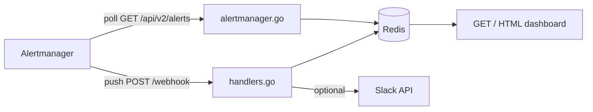

# KContext

Collect operational context from OpenShift / Kubernetes clusters — logs, alerts, and error signals — and package it for humans or AI-assisted triage.

When something fires, operators need more than the alert text. KContext gathers the surrounding signals (pod logs, events, related metrics) into a structured bundle so you can debug faster or hand off a concise summary to an LLM for analysis.

## Goals

| Layer | What KContext does |
|-------|-------------------|
| **Collect** | Pull logs, events, and cluster state around a failing workload or namespace |
| **Correlate** | Tie collection to firing alerts and error signals (crash loops, OOMKills, probe failures) |
| **Notify** | Post alert summaries to Slack (or other channels) for on-call visibility |
| **Analyze** | *(planned)* Export context bundles formatted for AI-assisted root-cause analysis |

## Status

**Implemented today:**

- Alertmanager API polling — pulls active alerts from `/api/v2/alerts` on an interval
- Alertmanager webhook receiver — captures push alerts and stores them in Redis
- HTML dashboard at `/` — filterable, paginated alert browser (50 per page)
- Optional Slack notifications — daily threaded alert summaries when configured

**Planned:** Log extraction via `oc` / API, event scraping, context bundling, and optional AI analysis pipeline.

## Project structure

```
KContext/
├── main.go           # Entry point — wires Redis, HTTP routes, optional poller & Slack
├── alertmanager.go   # Alertmanager API client and background polling loop
├── store.go          # Redis persistence, deduplication, and StoredAlert helpers
├── handlers.go       # HTTP handlers, HTML dashboard template, webhook receiver
├── filters.go        # Query-param filters, pagination, URL helpers
├── slack.go          # Slack chat.postMessage helper
├── go.mod
└── README.md
```

| File | Responsibility |
|------|----------------|
| `main.go` | Creates `AlertStore`, starts `startAlertmanagerPoller` when `ALERTMANAGER_URL` is set, registers `GET /` and `POST /webhook` |
| `alertmanager.go` | `GET {ALERTMANAGER_URL}/api/v2/alerts` on a ticker; maps results into `SyncPolled` |
| `store.go` | Saves alerts to Redis list `kcontext:alerts`; tracks fingerprints for poll dedup / resolved detection |
| `handlers.go` | Renders the dashboard; accepts Alertmanager webhook JSON |
| `filters.go` | Parses `severity`, `status`, `source`, `range`, `namespace`, `alertname`, `page` query params |
| `slack.go` | Posts alert text (and runbook URL when present) into daily Slack threads |

## How alerts flow



### Ingest paths

KContext supports two complementary ways to receive alerts:

1. **Poll (pull)** — background goroutine queries Alertmanager directly
2. **Webhook (push)** — Alertmanager POSTs to KContext when alerts fire or resolve

Both paths write to the same Redis store and appear on the same dashboard.

## Alert polling

Polling is enabled when `ALERTMANAGER_URL` is set. On startup, `main.go` launches `startAlertmanagerPoller` in a goroutine.

### Request

Every `ALERTMANAGER_POLL_INTERVAL` (default **30s**), KContext calls:

```
GET {ALERTMANAGER_URL}/api/v2/alerts?active=true&silenced=false&inhibited=false
Authorization: Bearer {token}   # when ALERTMANAGER_TOKEN or TOKEN_FILE is set
```

Try it manually (with port-forward running):

```bash
curl -sk -H "Authorization: Bearer $(oc whoami -t)" \
  'https://localhost:9094/api/v2/alerts?active=true&silenced=false&inhibited=false' | jq .
```

### Example response

Alertmanager returns a **JSON array** of active alerts. Each element looks like this (OpenShift / Prometheus example):

```json
[
  {
    "annotations": {
      "description": "PersistentVolume is expected to fill up within 4 days.",
      "runbook_url": "https://github.com/openshift/runbooks/blob/master/alerts/cluster-monitoring-operator/PersistentVolumeFillingUp.md",
      "summary": "PersistentVolume is filling up."
    },
    "endsAt": "0001-01-01T00:00:00Z",
    "fingerprint": "b2c3d4e5f6a7890123456789abcdef0",
    "receivers": [
      { "name": "Default" }
    ],
    "startsAt": "2026-06-29T14:22:10.456Z",
    "status": {
      "inhibitedBy": [],
      "silencedBy": [],
      "state": "active"
    },
    "updatedAt": "2026-06-29T14:25:00.123Z",
    "generatorURL": "https://prometheus-k8s.openshift-monitoring.svc:9091/graph?g0.expr=...",
    "labels": {
      "alertname": "PersistentVolumeFillingUp",
      "namespace": "openshift-monitoring",
      "persistentvolumeclaim": "prometheusdb-prometheus-k8s-0",
      "severity": "warning",
      "job": "kube-state-metrics"
    }
  },
  {
    "annotations": {
      "summary": "Cluster CPU usage above 90% for 15 minutes."
    },
    "endsAt": "0001-01-01T00:00:00Z",
    "fingerprint": "c3d4e5f6a7890123456789abcdef01234",
    "receivers": [
      { "name": "Default" }
    ],
    "startsAt": "2026-06-29T13:05:00.000Z",
    "status": {
      "inhibitedBy": [],
      "silencedBy": [],
      "state": "active"
    },
    "updatedAt": "2026-06-29T14:25:00.123Z",
    "generatorURL": "https://prometheus-k8s.openshift-monitoring.svc:9091/graph?g0.expr=...",
    "labels": {
      "alertname": "ClusterCPUHigh",
      "severity": "critical"
    }
  }
]
```

| Field | Used by KContext |
|-------|------------------|
| `fingerprint` | Deduplication — one stored row per unique alert instance |
| `labels` | Alert name, severity, namespace, pod, etc. on the dashboard |
| `annotations` | Summary, description, `runbook_url` link |
| `status.state` | Part of the API response (`active`, `suppressed`, …); polled alerts are stored as `firing` |
| `startsAt` / `endsAt` | Parsed but not shown on dashboard (KContext uses `received_at` instead) |
| `receivers`, `generatorURL`, `updatedAt` | Ignored |

When an alert disappears from this list on the next poll, KContext records a `resolved` entry using the cached labels and annotations from the last time it was seen.

### Processing

For each returned alert:

1. Read `fingerprint`, `labels`, and `annotations`
2. Store as status `firing` (the `active=true` query already limits to active alerts)
3. Pass to `AlertStore.SyncPolled`, which:
   - **New alert** (unknown fingerprint) → append to Redis with `source: poll`
   - **Unchanged alert** (same fingerprint + status) → skip (no duplicate row)
   - **Missing alert** (fingerprint was active, no longer in API response) → append a `resolved` entry using cached labels/annotations

Fingerprint state is tracked in Redis keys:

| Key | Purpose |
|-----|---------|
| `kcontext:alerts` | List of JSON `StoredAlert` records (newest first, trimmed to `ALERT_MAX`) |
| `kcontext:active-fingerprints` | Set of currently firing fingerprints |
| `kcontext:fp-state` | Last known status per fingerprint |
| `kcontext:fp-meta` | Cached labels/annotations for resolved detection |

### OpenShift

```bash
# in-cluster
export ALERTMANAGER_URL=https://alertmanager-main.openshift-monitoring.svc:9094
export ALERTMANAGER_TOKEN_FILE=/var/run/secrets/kubernetes.io/serviceaccount/token
export ALERTMANAGER_TLS_INSECURE=true

# local dev (requires oc login + port-forward)
oc port-forward -n openshift-monitoring svc/alertmanager-main 9094:9094
export ALERTMANAGER_URL=https://localhost:9094
export ALERTMANAGER_TOKEN=$(oc whoami -t)
export ALERTMANAGER_TLS_INSECURE=true
```

The token needs permission to read Alertmanager (e.g. `cluster-monitoring-view`).

## Webhook ingest

`POST /webhook` accepts the [Prometheus Alertmanager webhook JSON](https://prometheus.io/docs/alerting/latest/configuration/#webhook_config).

Each alert in the payload is saved immediately with `source: webhook`. If Slack is configured, alerts are also posted into a daily thread.

```yaml
receivers:
  - name: kcontext
    webhook_configs:
      - url: http://kcontext:8080/webhook
        send_resolved: true
```

## Dashboard rendering

`GET /` loads up to **500** alerts from Redis, applies filters, paginates, and renders server-side HTML via Go's `html/template` (embedded in `handlers.go`).

### Display

- Table columns: received time, status, alert name, namespace, severity, source, summary, runbook link
- Row background color reflects severity for firing alerts (critical / warning / info)
- Namespace values are clickable — filter to that namespace
- Runbook links come from `annotations.runbook_url` (or `runbook`)
- **KContext** title links to `/` and clears all filters

### Filters (auto-apply on dropdown change)

| Query param | Values |
|-------------|--------|
| `severity` | `critical`, `warning`, `info` |
| `status` | `firing`, `resolved`, `suppressed` |
| `source` | `poll`, `webhook` |
| `range` | `today`, `7d`, `14d`, `30d` |
| `namespace` | exact namespace name |
| `alertname` | substring match (press Enter) |
| `page` | page number (50 alerts per page) |

Example: `/?range=today&severity=critical&namespace=openshift-monitoring&page=2`

## Requirements

- Go 1.22+
- Redis
- Access to cluster Alertmanager *(for polling)* or Alertmanager webhook config *(for push)*
- Slack app with `chat:write` scope *(optional, for notifications)*

## Configuration

| Variable | Required | Default | Description |
|----------|----------|---------|-------------|
| `REDIS_ADDR` | no | `localhost:6379` | Redis address |
| `ALERT_MAX` | no | `500` | Max alerts kept in Redis |
| `LISTEN_ADDR` | no | `:8080` | HTTP listen address |
| `ALERTMANAGER_URL` | no | — | Alertmanager base URL; enables polling when set |
| `ALERTMANAGER_POLL_INTERVAL` | no | `30s` | How often to poll Alertmanager |
| `ALERTMANAGER_TOKEN` | no | — | Bearer token for Alertmanager API |
| `ALERTMANAGER_TOKEN_FILE` | no | — | Path to token file (e.g. in-cluster SA token) |
| `ALERTMANAGER_TLS_INSECURE` | no | `false` | Skip TLS verification (`true` for port-forward) |
| `SLACK_TOKEN` | no | — | Slack bot token (`xoxb-...`) |
| `SLACK_CHANNEL_ID` | no | — | Target channel ID (`C...`) |

## Run locally

Start Redis, then:

```bash
export REDIS_ADDR=localhost:6379
go run .
```

Open [http://localhost:8080/](http://localhost:8080/) for the alerts dashboard.

Optional Slack:

```bash
export SLACK_TOKEN=xoxb-...
export SLACK_CHANNEL_ID=C0XXXXXXXXX
```

## Endpoints

| Method | Path | Description |
|--------|------|-------------|
| `GET` | `/` | HTML dashboard — filtered, paginated alert list |
| `POST` | `/webhook` | Alertmanager webhook — stores each alert in Redis |

## Test with curl

```bash
curl -X POST http://localhost:8080/webhook \
  -H 'Content-Type: application/json' \
  -d '{
    "alerts": [{
      "status": "firing",
      "labels": {
        "alertname": "HighCPU",
        "severity": "warning",
        "namespace": "openshift-monitoring",
        "pod": "prometheus-k8s-0"
      },
      "annotations": {
        "summary": "CPU usage above 90%",
        "runbook_url": "https://github.com/openshift/runbooks/example.md"
      }
    }]
  }'
```

Refresh the dashboard to see the alert.

## Slack setup

1. Create an app at [api.slack.com/apps](https://api.slack.com/apps)
2. Add the **chat:write** bot scope
3. Install the app to your workspace
4. Invite the bot to the target channel (`/invite @KContext`)

When configured, KContext opens one parent message per day and replies with each webhook alert in that thread.
