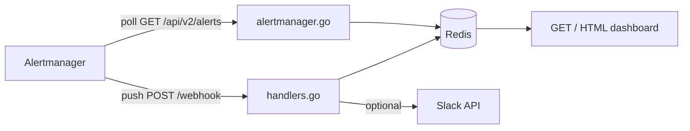

# KContext

Collect operational context from OpenShift / Kubernetes clusters — logs, alerts, and error signals — and package it for humans or AI-assisted triage.

When something fires, operators need more than the alert text. KContext gathers the surrounding signals (pod logs, events, related metrics) into a structured bundle so you can debug faster or hand off a concise summary to an LLM for analysis.

## Catalog

| Section | Description |
|---------|-------------|
| [Goals](#goals) | What KContext aims to collect, correlate, notify, and analyze |
| [Status](#status) | Implemented features and planned work |
| [Project structure](#project-structure) | Source layout and file responsibilities |
| [How alerts flow](#how-alerts-flow) | Poll vs webhook ingest paths |
| [Alert polling](#alert-polling) | Alertmanager API pull, dedup, and resolved detection |
| [Webhook ingest](#webhook-ingest) | Alertmanager push receiver config |
| [Dashboard rendering](#dashboard-rendering) | HTML UI, filters, and pagination |
| [Requirements](#requirements) | Runtime dependencies |
| [Configuration](#configuration) | Environment variables |
| [Run locally](#run-locally) | Start Redis and the app on your machine |
| [Redis data migration](#redis-data-migration) | Copy alert history between Redis instances |
| [Development](#development) | Cursor rules, pre-commit hook, and CI |
| [Endpoints](#endpoints) | HTTP routes |
| [Test with curl](#test-with-curl) | Send a sample webhook payload |
| [Slack setup](#slack-setup) | Bot token, scope, and channel config |

## Goals

| Layer | What KContext does |
|-------|-------------------|
| **Collect** | Pull logs, events, and cluster state around a failing workload or namespace |
| **Correlate** | Tie collection to firing alerts and error signals (crash loops, OOMKills, probe failures) |
| **Notify** | Post alert summaries to Slack (or other channels) for on-call visibility |
| **Analyze** | *(planned)* Export context bundles formatted for AI-assisted root-cause analysis |

## Status

**Implemented today:**

- Alertmanager API polling — pulls active alerts from `/api/v2/alerts` on an interval
- Alertmanager webhook receiver — captures push alerts and stores them in Redis
- HTML dashboard at `/` — filterable, paginated alert browser (50 per page)
- Optional Slack notifications — daily threaded alert summaries when configured

**Planned:** Log extraction via `oc` / API, event scraping, context bundling, and optional AI analysis pipeline.

## Project structure

```
KContext/
├── .cursor/rules/    # Cursor AI rules (project context, Go standards, testing)
├── .github/workflows/# CI — go test, go vet, markdownlint
├── hooks/            # Git hooks (pre-commit)
├── cmd/kcontext/     # main package — `go run ./cmd/kcontext`
├── run.go            # Run() — wires Redis, HTTP routes, optional poller & Slack
├── alertmanager.go   # Alertmanager API client and background polling loop
├── store.go          # Redis persistence, deduplication, and StoredAlert helpers
├── handlers.go       # HTTP handlers, HTML dashboard template, webhook receiver
├── filters.go        # Query-param filters, pagination, URL helpers
├── slack.go          # Slack chat.postMessage helper
├── details.go        # Alert detail page handler
├── tests/            # External test package (kcontext_test)
├── go.mod
└── README.md
```

| File | Responsibility |
|------|----------------|
| `cmd/kcontext/main.go` | Entry point; calls `kcontext.Run()` |
| `run.go` | Creates `AlertStore`, starts poller when configured, registers HTTP routes |
| `alertmanager.go` | `GET {ALERTMANAGER_URL}/api/v2/alerts` on a ticker; maps results into `SyncPolled` |
| `store.go` | Saves alerts to Redis list `kcontext:alerts`; tracks fingerprints for poll dedup / resolved detection |
| `handlers.go` | Renders the dashboard; accepts Alertmanager webhook JSON |
| `filters.go` | Parses `severity`, `status`, `source`, `range`, `namespace`, `alertname`, `page` query params |
| `slack.go` | Posts alert text (and runbook URL when present) into daily Slack threads |

## How alerts flow



### Ingest paths

KContext supports two complementary ways to receive alerts:

1. **Poll (pull)** — background goroutine queries Alertmanager directly
2. **Webhook (push)** — Alertmanager POSTs to KContext when alerts fire or resolve

Both paths write to the same Redis store and appear on the same dashboard.

## Alert polling

Polling is **enabled by default** against `https://localhost:9094`. KContext starts `oc port-forward` automatically when the URL is localhost (or unset). Set `ALERTMANAGER_PORT_FORWARD=false` to manage port-forward yourself, or `ALERTMANAGER_URL=""` to disable polling entirely.

### Request

Every `ALERTMANAGER_POLL_INTERVAL` (default **10s**), KContext calls:

```
GET {ALERTMANAGER_URL}/api/v2/alerts?active=true&silenced=true&inhibited=true&unprocessed=true
Authorization: Bearer {token}   # ALERTMANAGER_TOKEN, ALERTMANAGER_TOKEN_FILE, or oc whoami -t
```

This uses Alertmanager’s default inclusive filters so **all alerts currently held in Alertmanager** are returned (firing, silenced, inhibited, and unprocessed). Alertmanager still drops resolved alerts after `resolve_timeout` (~5 minutes) — this is not long-term history.

Try it manually (with port-forward running):

```bash
curl -sk -H "Authorization: Bearer $(oc whoami -t)" \
  'https://localhost:9094/api/v2/alerts?active=true&silenced=true&inhibited=true&unprocessed=true' | jq .
```

### Example response

Alertmanager returns a **JSON array** of alerts. Each element looks like this (OpenShift / Prometheus example):

```json
[
  {
    "annotations": {
      "description": "PersistentVolume is expected to fill up within 4 days.",
      "runbook_url": "https://github.com/openshift/runbooks/blob/master/alerts/cluster-monitoring-operator/PersistentVolumeFillingUp.md",
      "summary": "PersistentVolume is filling up."
    },
    "endsAt": "0001-01-01T00:00:00Z",
    "fingerprint": "b2c3d4e5f6a7890123456789abcdef0",
    "receivers": [
      { "name": "Default" }
    ],
    "startsAt": "2026-06-29T14:22:10.456Z",
    "status": {
      "inhibitedBy": [],
      "silencedBy": [],
      "state": "active"
    },
    "updatedAt": "2026-06-29T14:25:00.123Z",
    "generatorURL": "https://prometheus-k8s.openshift-monitoring.svc:9091/graph?g0.expr=...",
    "labels": {
      "alertname": "PersistentVolumeFillingUp",
      "namespace": "openshift-monitoring",
      "persistentvolumeclaim": "prometheusdb-prometheus-k8s-0",
      "severity": "warning",
      "job": "kube-state-metrics"
    }
  },
  {
    "annotations": {
      "summary": "Cluster CPU usage above 90% for 15 minutes."
    },
    "endsAt": "0001-01-01T00:00:00Z",
    "fingerprint": "c3d4e5f6a7890123456789abcdef01234",
    "receivers": [
      { "name": "Default" }
    ],
    "startsAt": "2026-06-29T13:05:00.000Z",
    "status": {
      "inhibitedBy": [],
      "silencedBy": [],
      "state": "active"
    },
    "updatedAt": "2026-06-29T14:25:00.123Z",
    "generatorURL": "https://prometheus-k8s.openshift-monitoring.svc:9091/graph?g0.expr=...",
    "labels": {
      "alertname": "ClusterCPUHigh",
      "severity": "critical"
    }
  }
]
```

| Field | Used by KContext |
|-------|------------------|
| `fingerprint` | Deduplication — one stored row per unique alert instance |
| `labels` | Alert name, severity, namespace, pod, etc. on the dashboard |
| `annotations` | Summary, description, `runbook_url` link |
| `status.state` | Mapped to stored status: `active`/`unprocessed` → `firing`, `suppressed` → `suppressed`, past `endsAt` → `resolved` |
| `startsAt` / `endsAt` | Shown on alert detail page only |
| `updatedAt` | Dashboard **Updated at** column (falls back to `received_at` when missing) |
| `receivers`, `generatorURL` | Ignored |

When an alert disappears from this list on the next poll, KContext records a `resolved` entry using the cached labels and annotations from the last time it was seen.

### Processing

For each returned alert:

1. Read `fingerprint`, `labels`, and `annotations`
2. Map Alertmanager state to stored status (`firing`, `suppressed`, or `resolved` when `endsAt` is in the past)
3. Pass to `AlertStore.SyncPolled`, which:
   - **New alert** (unknown fingerprint) → append to Redis with `source: poll`
   - **Unchanged alert** (same fingerprint + status) → skip (no duplicate row)
   - **Missing alert** (fingerprint was active, no longer in API response) → append a `resolved` entry using cached labels/annotations

Fingerprint state is tracked in Redis keys:

| Key | Purpose |
|-----|---------|
| `kcontext:alerts` | List of JSON `StoredAlert` records (newest first) |
| `kcontext:active-fingerprints` | Set of currently firing fingerprints |
| `kcontext:fp-state` | Last known status per fingerprint |
| `kcontext:fp-meta` | Cached labels/annotations for resolved detection |

### OpenShift

```bash
# in-cluster
export ALERTMANAGER_URL=https://alertmanager-main.openshift-monitoring.svc:9094
export ALERTMANAGER_TOKEN_FILE=/var/run/secrets/kubernetes.io/serviceaccount/token
export ALERTMANAGER_TLS_INSECURE=true

# local dev (oc login required; port-forward is started automatically by KContext)
go run ./cmd/kcontext

# or manage port-forward yourself:
# oc port-forward -n openshift-monitoring svc/alertmanager-main 9094:9094
# export ALERTMANAGER_PORT_FORWARD=false
```

The token needs permission to read Alertmanager (e.g. `cluster-monitoring-view`).

## Webhook ingest

`POST /webhook` accepts the [Prometheus Alertmanager webhook JSON](https://prometheus.io/docs/alerting/latest/configuration/#webhook_config).

Each alert in the payload is saved immediately with `source: webhook`. If Slack is configured, alerts are also posted into a daily thread.

```yaml
receivers:
  - name: kcontext
    webhook_configs:
      - url: http://kcontext:8083/webhook
        send_resolved: true
```

## Dashboard rendering

`GET /` loads all alerts from Redis, applies filters, paginates, and renders server-side HTML via Go's `html/template` (embedded in `handlers.go`).

### Display

- Table columns: updated at, status, alert name, namespace, severity, source, summary, runbook link
- Rows sorted by **Updated at** (newest first), then by alert ID
- Row background color reflects severity for firing alerts (critical / warning / info)
- Namespace values are clickable — filter to that namespace
- Runbook links come from `annotations.runbook_url` (or `runbook`)
- **KContext** title links to `/` and clears all filters

### Filters (auto-apply on dropdown change)

| Query param | Values |
|-------------|--------|
| `severity` | `critical`, `warning`, `info` |
| `status` | `firing`, `resolved`, `suppressed` |
| `source` | `poll`, `webhook` |
| `range` | `today`, `7d`, `14d`, `30d`, or `custom` (opens custom panel) |
| `days` | with `range=custom` — past N days rolling window |
| `from` / `to` | with `range=custom` — calendar range (`YYYY-MM-DD`, inclusive) |
| `namespace` | exact namespace name |
| `alertname` | substring match (press Enter) |
| `page` | page number (50 alerts per page) |

Example: `/?range=today&severity=critical&namespace=openshift-monitoring&page=2`

Custom date (choose **Custom…** in the Date dropdown):

- **Past N days** — enter a number and click Apply
- **Calendar range** — pick From/To dates and click Apply

URL examples: `/?range=custom&days=3` or `/?range=custom&from=2026-06-28&to=2026-06-29`

## Requirements

- Go 1.22+
- Redis
- Access to cluster Alertmanager *(for polling)* or Alertmanager webhook config *(for push)*
- Slack app with `chat:write` scope *(optional, for notifications)*

## Configuration

| Variable | Required | Default | Description |
|----------|----------|---------|-------------|
| `REDIS_ADDR` | no | `localhost:6379` | Redis address |
| `LISTEN_ADDR` | no | `:8083` | HTTP listen address |
| `ALERTMANAGER_URL` | no | `https://localhost:9094` | Alertmanager base URL; set to `""` to disable polling |
| `ALERTMANAGER_PORT_FORWARD` | no | `auto` | Start `oc port-forward` when URL is localhost; `false` to disable, `true` to force |
| `ALERTMANAGER_PF_NAMESPACE` | no | `openshift-monitoring` | Namespace for auto port-forward |
| `ALERTMANAGER_PF_SERVICE` | no | `alertmanager-main` | Service name for auto port-forward |
| `ALERTMANAGER_PF_LOCAL_PORT` | no | `9094` | Local port for auto port-forward |
| `ALERTMANAGER_PF_REMOTE_PORT` | no | `9094` | Remote port for auto port-forward |
| `ALERTMANAGER_POLL_INTERVAL` | no | `10s` | How often to poll Alertmanager |
| `ALERTMANAGER_TOKEN` | no | `oc whoami -t` | Bearer token for Alertmanager API |
| `ALERTMANAGER_TOKEN_FILE` | no | — | Path to token file (overrides token env; e.g. in-cluster SA token) |
| `ALERTMANAGER_TLS_INSECURE` | no | `true` | Skip TLS verification (`false` for proper TLS) |
| `SLACK_TOKEN` | no | — | Slack bot token (`xoxb-...`) |
| `SLACK_CHANNEL_ID` | no | — | Target channel ID (`C...`) |

## Run locally

Start Redis, then:

```bash
export REDIS_ADDR=localhost:6379
go run ./cmd/kcontext
```

Open [http://localhost:8083/](http://localhost:8083/) for the alerts dashboard.

Optional Slack:

```bash
export SLACK_TOKEN=xoxb-...
export SLACK_CHANNEL_ID=C0XXXXXXXXX
```

## Redis data migration

Move alert history from a local Redis instance to a remote one (e.g. a bastion host). This is useful when you developed locally and want the dashboard on a shared server without re-ingesting alerts.

### Redis keys

| Key | Type | Needed for dashboard? |
|-----|------|----------------------|
| `kcontext:alerts` | List | **Yes** — JSON `StoredAlert` records (newest first) |
| `kcontext:active-fingerprints` | Set | No — poll dedup only |
| `kcontext:fp-state` | Hash | No — poll dedup only |
| `kcontext:fp-meta` | Hash | No — resolved detection for polling |

For dashboard history, copying **`kcontext:alerts`** is enough. Copy the other three only if you also run Alertmanager polling on the destination and want dedup/resolved state preserved.

### Why not DUMP / RESTORE?

`redis-cli DUMP` + `RESTORE` fails across **different Redis major versions** (e.g. 7.2 → 6.2) with:

```
ERR DUMP payload version or checksum are wrong
```

Use the **logical copy** below instead — it works across versions because each alert is plain JSON text.

### Copy alerts (dashboard data)

Set `REMOTE` to your destination host, then export, transfer, and import:

```bash
REMOTE=root@your-bastion.example.com

# export from local Redis
redis-cli --raw LRANGE kcontext:alerts 0 -1 > /tmp/kcontext_alerts.txt

# transfer to remote
scp /tmp/kcontext_alerts.txt "$REMOTE:/tmp/"

# import on remote (replaces existing kcontext:alerts)
ssh "$REMOTE" 'redis-cli DEL kcontext:alerts
while IFS= read -r line; do
  [ -n "$line" ] && redis-cli LPUSH kcontext:alerts "$line"
done < /tmp/kcontext_alerts.txt
rm /tmp/kcontext_alerts.txt'
```

`LRANGE` returns newest-first; `LPUSH` preserves that order on the destination.

### Verify

```bash
redis-cli LLEN kcontext:alerts
ssh "$REMOTE" redis-cli LLEN kcontext:alerts
```

Counts should match. On the remote host, start KContext with `REDIS_ADDR` pointing at that Redis instance and open `/?range=7d`.

### Optional: copy poll state

Only needed when running Alertmanager polling on the destination.

**Set** (`kcontext:active-fingerprints`):

```bash
redis-cli SMEMBERS kcontext:active-fingerprints > /tmp/fps.txt
scp /tmp/fps.txt "$REMOTE:/tmp/"
ssh "$REMOTE" 'redis-cli DEL kcontext:active-fingerprints
while IFS= read -r fp; do
  [ -n "$fp" ] && redis-cli SADD kcontext:active-fingerprints "$fp"
done < /tmp/fps.txt'
```

**Hashes** (`kcontext:fp-state`, `kcontext:fp-meta`):

```bash
for key in kcontext:fp-state kcontext:fp-meta; do
  redis-cli EXISTS "$key" | grep -q '^1$' || continue
  redis-cli HGETALL "$key" > "/tmp/${key//:/_}.txt"
  scp "/tmp/${key//:/_}.txt" "$REMOTE:/tmp/hash.txt"
  ssh "$REMOTE" "redis-cli DEL '$key'
while read -r field && read -r val; do
  [ -n \"\$field\" ] && redis-cli HSET '$key' \"\$field\" \"\$val\"
done < /tmp/hash.txt"
done
```

## Development

### Cursor rules

Project-specific AI guidance lives in `.cursor/rules/` (adapted from the vstorm project):

| Rule | Scope | Purpose |
|------|-------|---------|
| `project-context.mdc` | always | Architecture, Redis keys, dependencies |
| `go-standards.mdc` | `**/*.go` | Go conventions, error handling, HTTP patterns |
| `redis-store.mdc` | `store.go` | Redis key layout, dedup, migration notes |
| `go-testing.mdc` | `**/*_test.go` | Table-driven tests, httptest, miniredis |
| `ci-workflow.mdc` | `.github/workflows/*` | GitHub Actions conventions |
| `pre-commit-checks.mdc` | always | Checks to run before committing |
| `karpathy-guidelines.mdc` | always | Simplicity, surgical changes, goal-driven execution |
| `test-fix-discipline.mdc` | always | Fix code before weakening tests |
| `cursor-debug-logs.mdc` | always | Debug logs go under `logs/`, not `.cursor/` |

### Pre-commit hook

Install once:

```bash
git config core.hooksPath hooks
```

The hook runs `go test`, `go vet` when Go files are staged, and `markdownlint-cli2` on staged Markdown. The script itself is Bash (standard for git hooks); no separate shell coding rule is needed for this Go project.

### CI

GitHub Actions (`.github/workflows/test.yaml`) runs on push/PR to `main`:

- `go test -race ./...`
- `go vet ./...`
- `markdownlint-cli2` on `**/*.md`

### Tests

```bash
go test ./...
go test -race -cover ./...
go vet ./...
```

| File | Covers |
|------|--------|
| `tests/filters_test.go` | Query filters, pagination, `StoredAlert` helpers, page links |
| `tests/store_test.go` | Redis save/list/trim, `Get`, `SyncPolled` dedup and resolved (via miniredis) |
| `tests/handlers_test.go` | Webhook ingest, dashboard HTML, method guards |
| `tests/helpers_test.go` | Shared test fixtures (`testStore`, `testServer`, `sampleAlert`) |

Tests use `package kcontext_test` and import `github.com/gqlo/kcontext`. Store and handler tests use [miniredis](https://github.com/alicebob/miniredis) — no live Redis required for CI or local `go test ./...`.

## Endpoints

| Method | Path | Description |
|--------|------|-------------|
| `GET` | `/` | HTML dashboard — filtered, paginated alert list |
| `POST` | `/webhook` | Alertmanager webhook — stores each alert in Redis |

## Test with curl

```bash
curl -X POST http://localhost:8083/webhook \
  -H 'Content-Type: application/json' \
  -d '{
    "alerts": [{
      "status": "firing",
      "labels": {
        "alertname": "HighCPU",
        "severity": "warning",
        "namespace": "openshift-monitoring",
        "pod": "prometheus-k8s-0"
      },
      "annotations": {
        "summary": "CPU usage above 90%",
        "runbook_url": "https://github.com/openshift/runbooks/example.md"
      }
    }]
  }'
```

Refresh the dashboard to see the alert.

## Slack setup

1. Create an app at [api.slack.com/apps](https://api.slack.com/apps)
2. Add the **chat:write** bot scope
3. Install the app to your workspace
4. Invite the bot to the target channel (`/invite @KContext`)

When configured, KContext opens one parent message per day and replies with each webhook alert in that thread.
