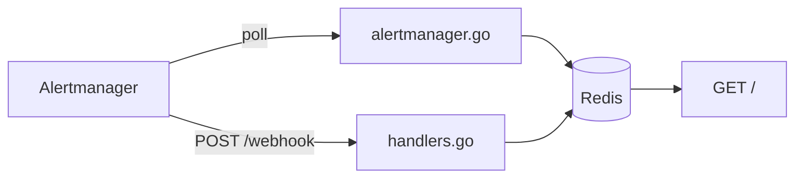

# How alerts flow

KContext supports two complementary ingest paths:

1. **Poll (pull)** — background goroutine queries Alertmanager directly (`GET /api/v2/alerts`). See [alert-polling.md](alert-polling.md).
2. **Webhook (push)** — Alertmanager POSTs to KContext when alerts fire or resolve. See [webhook-ingest.md](webhook-ingest.md).

Both paths write to the same Redis store and appear on the same dashboard. Poll and webhook alerts are tagged with `source: poll` or `source: webhook` respectively.

## Related

| Topic | Example |
|-------|---------|
| Webhook receiver config and testing | [webhook-ingest.md](webhook-ingest.md) |
| Poll API and OpenShift RBAC | [alert-polling.md](alert-polling.md) |
| HTTP routes | [endpoints.md](endpoints.md) |
| Dashboard filters | [dashboard.md](dashboard.md) |
